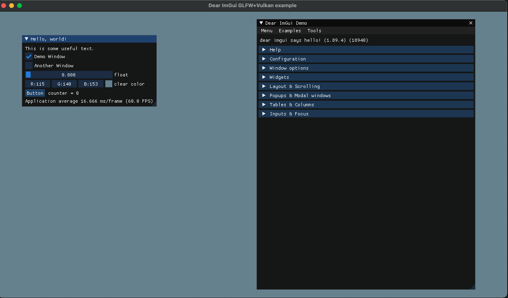

NOTE

init project, add gitignore

add vcpkg as submodule:
`git submodule add https://github.com/microsoft/vcpkg.git`

init vcpkg:
`./vcpkg/bootstrap-vcpkg.sh`

create vcpkg.json add dependencies in it

install dependencies with vcpkg:
`./vcpkg/vcpkg install`

config vcpkg in CMakeLists.txt:

`set(CMAKE_TOOLCHAIN_FILE "${CMAKE_CURRENT_SOURCE_DIR}/vcpkg/scripts/buildsystems/vcpkg.cmake")`

find and link libraries to executables (example in `/demo`)

build

`cmake -Bbuild`

`cmake --build build`

run `./build/demo/demo`

